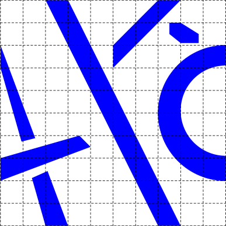
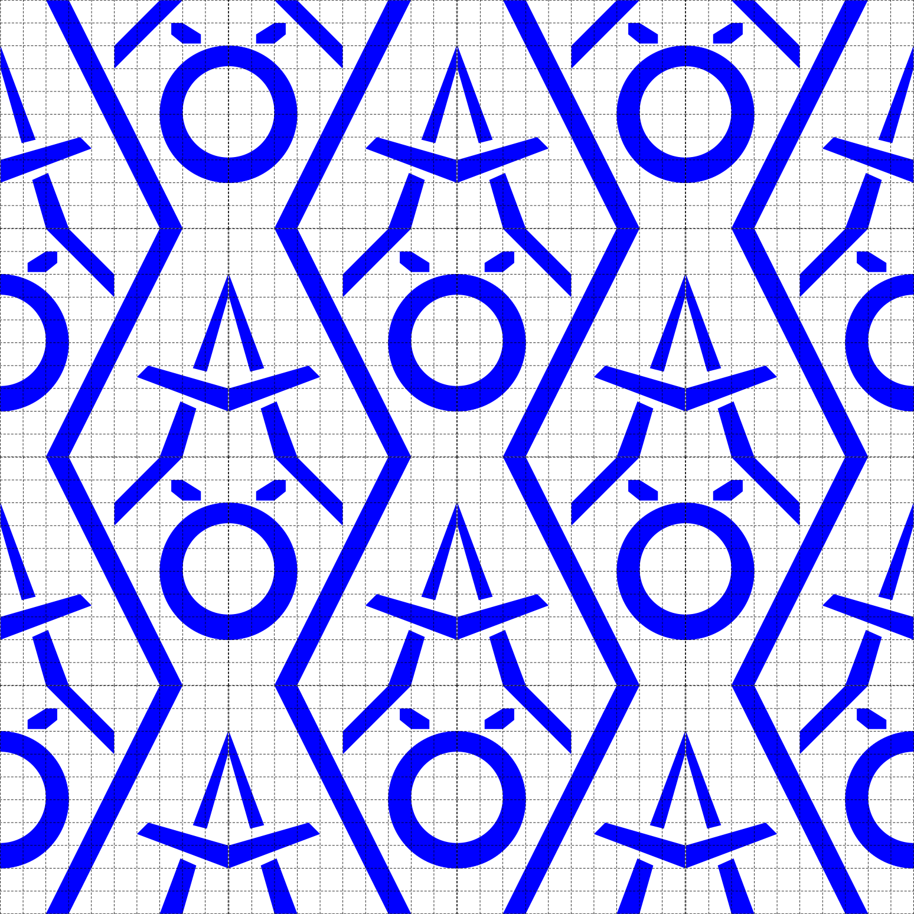
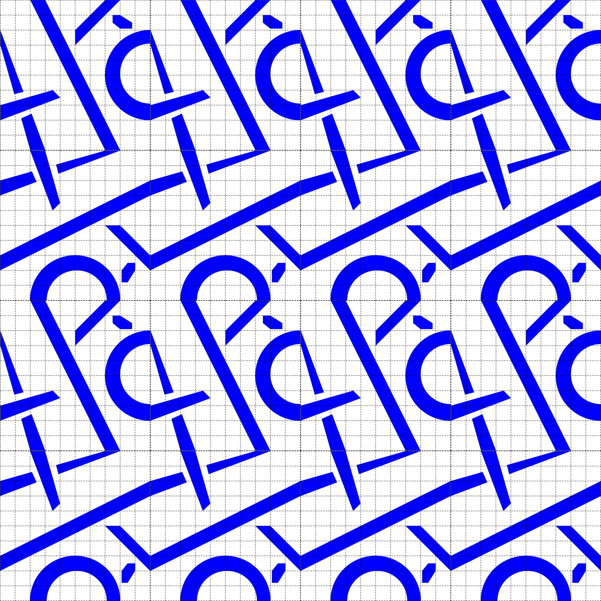
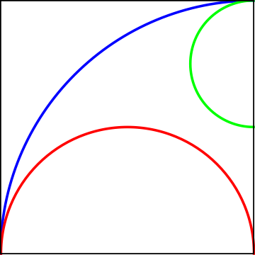
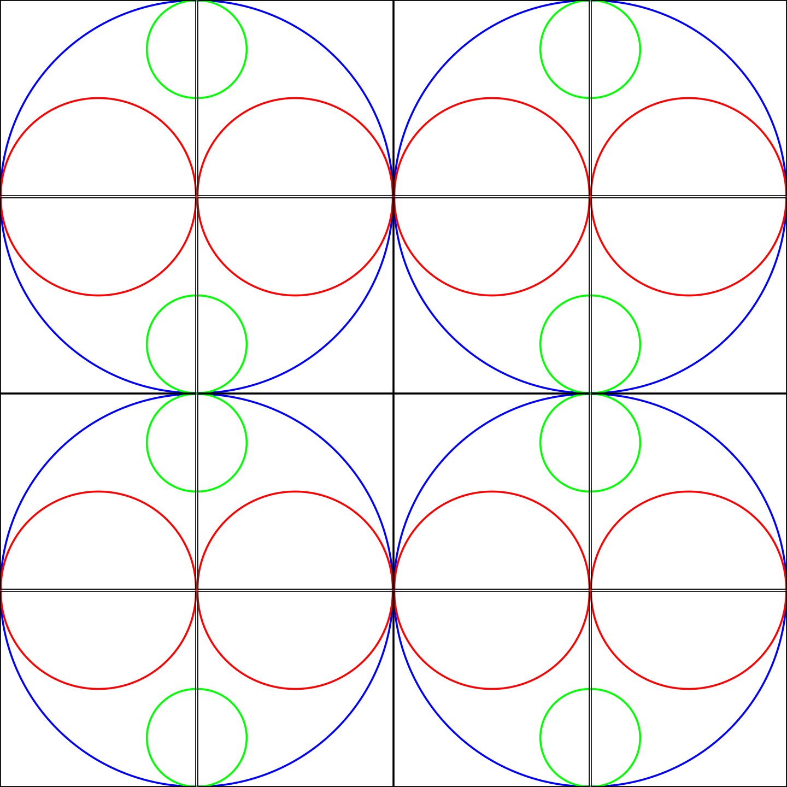
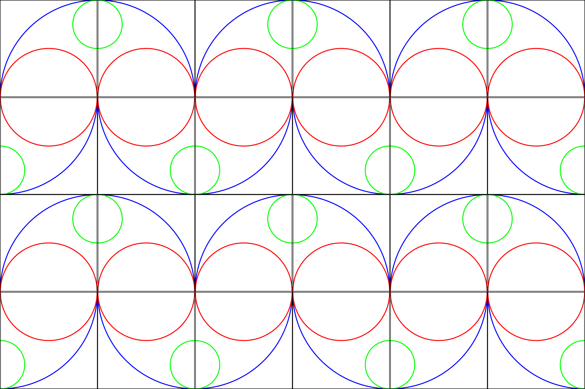

# Motifier

A CLI tool for generating Escher-style motif tilings.

## Examples

```
./target/release/motifier -m examples/1-in.png -b 2 -r 2 -c 2 -l one Uone Uone one -o examples/1-out.png
```



The program outputs an image with 2 rows and 2 columns of the translation block, where each translation block is composed of four orientations of the input `1-in.png`. The top left and bottom right are the original motif, and the top right and bottom left are horizontal mirrors of the original motif. 
***
```
./target/release/motifier -m examples/1-in.png -b 2 -r 2 -c 2 -l one two one two -o examples/1-out-2.png
```



Here the program uses the same input image, this time with the left two motifs in the translation block in their original orientations, and the right two rotated 90 degrees. This results in a very different image to the above.
***
```
./target/release/motifier -m examples/2-in.png -b 2 -r 2 -c 2 -l one Uthree Uone three -o examples/2-out-1.png
```



This image, using a new motif, rotates and flips the motif in different positions inside the translation block in order to construct a circle. 
***
```
./target/release/motifier -m examples/2-in.png -b 2 -r 2 -c 3 -l one three Uone Uthree -o examples/2-out-2.png
```



This image flips the bottom two elements of the translation block versus the above, resulting in a snaking pattern across the image.

## Build

First, make sure [Rust](https://www.rust-lang.org/tools/install) is installed on the system. Clone this repository, then run `cargo build --release` from the root directory. This will generate the program binary at `target/release/motifier`.

## Usage

Run `./target/release/motifier --help` to see the help menu. The following inputs are required by the program:
- -m (--motif): a filepath to the base image to use
- -b (--block-size): the size of the translation block in the output image (for example, -b 2 uses a 2x2 translation block)
- -r (--rows): the number of rows of translation blocks in the output image
- -c (--columns): the number of columns of translation blocks in the output image
- -l (--layout): a sequence of `block-size * block-size` keys denoting the orientation of each motif in the translation block, using Escher's notation. The accepted orientation keys are the following:
    - "one"
    - "two"
    - "three"
    - "four"
    - "Uone"
    - "Utwo"
    - "Uthree"
    - "Ufour"
- -o (--output): The path (including the filename) of the desired output image.

## References

George A. Escher, "Potato Printing, A Game for Winter Evenings", in M. C. Escher: Art and Science H. S. M. Coxeter, M. Emmer, R. Penrose, M. Teuber, eds. Amsterdam: North Holland, 1986, pp. 9-11

Schattschneider,  D.: Escher's combinatorial patterns. Electron. J. Comb., 4 (2), R17 (1997). Research Paper. Approx. 31 pp. The Wilf Festschrift (Philadelphia, PA, 1996)

Dan, D.: On a tiling scheme from M.C. Escher. Electron. J. Comb. 4(2), R23 (1997). Research Paper.Approx. 11 pp. The Wilf Festschrift (Philadelphia, PA, 1996)
    